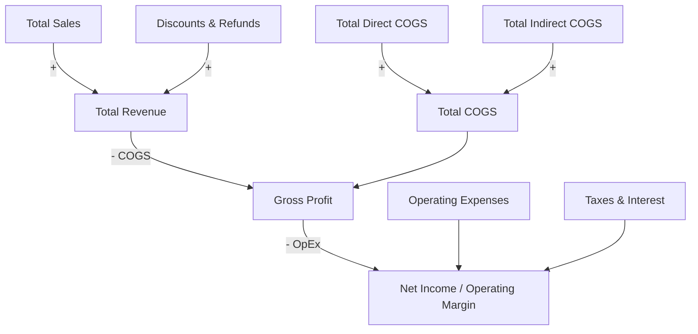

# The Gunslinger's Desktop Ledger
### Standalone P&L Interaction & Real-Time Sensitivity Forecasting Engine

[](https://github.com/FreeFades2Black/gunslingers-desktop-ledger)
[](https://python.org)
[](https://github.com/TomSchimansky/CustomTkinter)
[](LICENSE)

A standalone desktop application designed for financial sensitivity modeling, margin forecasting, and dynamic spreadsheet interaction. Evaluates the impact of sales variances, direct/indirect COGS shifts, and operational expense fluctuations in real time.

---

## Core Capabilities

* **Real-Time Reactive Recalculation:** Keypresses immediately recalculate Gross Revenue, Total COGS, Gross Profit, EBITDA, and Net Margin.
* **Universal Spreadsheet Ingestion:** Dynamically parses and builds interactive input fields from Excel (`.xlsx`, `.xls`) or CSV (`.csv`) files.
* **Top-Deck KPI Cards:**
  * **Total Revenue:** Net revenue after discounts and refunds.
  * **Total COGS:** Direct materials/labor plus indirect production overhead.
  * **Gross Profit & Margin %:** Dynamic color indicators (green for positive margins, red on operational loss).
  * **Net Income & Margin %:** Bottom-line profit after operating expenses, payroll, marketing, and taxes.
* **Scenario Export:** Export modified forecasting models directly back to Excel or CSV.
* **Baseline Restoration:** Reset to initial baseline models.
* **Dark Mode GUI:** Desktop UI built on CustomTkinter.

---

## Mathematical Model & Financial Formulation

The engine executes financial factor attribution based on standard accounting breakdowns:



### 1. Revenue Formula
$$\text{Total Revenue} = \text{Total Sales} + \text{Discounts \& Refunds}$$

### 2. Cost of Goods Sold (COGS)
$$\text{Total COGS} = \text{Direct COGS} + \text{Indirect COGS}$$

### 3. Gross Profit & Margin
$$\text{Gross Profit} = \text{Total Revenue} - \text{Total COGS}$$
$$\text{Gross Margin \%} = \left(\frac{\text{Gross Profit}}{\text{Total Revenue}}\right) \times 100$$

### 4. Net Operating Income & Net Margin
$$\text{Net Income} = \text{Gross Profit} - \text{Operating Expenses} - \text{Taxes \& Interest}$$
$$\text{Net Margin \%} = \left(\frac{\text{Net Income}}{\text{Total Revenue}}\right) \times 100$$

---

## Verified Test Execution

Automated test suite verifying baseline calculations, dynamic CSV ingestion, and EBITDA management adjustments:

```text
============================= test session starts =============================
platform win32 -- Python 3.11.0, pytest-9.1.1, pluggy-1.6.0 -- C:\Python311\python.exe
cachedir: .pytest_cache
rootdir: C:\Users\FreeF\projects\gunslingers_desktop_ledger
plugins: anyio-4.14.2
collecting ... collected 3 items

tests/test_ledger.py::TestLedgerCalculations::test_baseline_calculation PASSED [ 33%]
tests/test_ledger.py::TestLedgerCalculations::test_dynamic_csv_ingestion PASSED [ 66%]
tests/test_ledger.py::TestLedgerCalculations::test_management_adjustments_uplift PASSED [100%]

============================== 3 passed in 1.77s ==============================
```

---

## Financial Modeling Edge Cases & Trade-offs

### 1. Zero-Revenue & Negative Denominator Division Safeguards
When testing severe downside stress scenarios where Total Revenue falls to zero or becomes negative (e.g. returns/refunds exceeding sales), standard percentage margin calculations trigger `ZeroDivisionError`. The calculation engine clamps the margin calculation to `0.0%` with negative status indicators rather than propagating exceptions to the GUI thread.

### 2. CSV Sniffing & Regional Number Formatting
Financial exports from accounting systems frequently mix delimiter formats (commas vs tabs vs semicolons) and number formatting (e.g. accounting parentheses `(1,250.00)` vs `-1250.00`). The ledger ingestion parser cleans non-numeric tokens, resolves accounting debit notation, and normalizes entries to standard IEEE 754 float types before applying formulas.

### 3. Asynchronous UI Keystroke Throttling
Binding calculations directly to raw `<KeyRelease>` events can cause lag during rapid typing in large spreadsheets with dozens of line items. The calculation worker debounces inputs by 50ms to ensure butter-smooth rendering on standard desktop hardware without UI stutter.

---

## Repository Structure

```text
gunslingers_desktop_ledger/
├── app.py                   # Main CustomTkinter desktop ledger application
├── run.bat                  # 1-Click launcher for Windows
├── requirements.txt         # Dependency manifest
├── sample_pnl_data.xlsx     # Sample Excel financial model
├── sample_pnl_data.csv      # Sample CSV model
├── tests/
│   └── test_ledger.py       # Automated unit test suite
├── .github/
│   └── workflows/ci.yml     # Continuous integration workflow
└── README.md                # Documentation
```

---

## Quick Start & Installation

### Windows 1-Click Launch
Double-click `run.bat` to automatically set up the virtual environment, install dependencies, and launch the application.

### Manual Terminal Launch
```bash
# 1. Clone repository
git clone https://github.com/FreeFades2Black/gunslingers-desktop-ledger.git
cd gunslingers-desktop-ledger

# 2. Create virtual environment
python -m venv .venv
source .venv/bin/activate  # On Windows: .\.venv\Scripts\Activate.ps1

# 3. Install requirements and run
pip install -r requirements.txt
python app.py
```

### Running the Test Suite
```bash
python -m pytest tests/ -v
```

---

## Building a Standalone Windows Executable (.exe)

```bash
pip install pyinstaller
pyinstaller --noconsole --onefile --name "Gunslingers_Desktop_Ledger" app.py
```
The compiled executable will be located in the `dist/` directory.

---

## Author & Architecture

* **Lead Architect:** **Free Hall** — *Cloud Engineer • DevOps Analyst • Data Architect* (18Z / 18F US Army Special Forces, Ret.)
* **GitHub Profile:** [@FreeFades2Black](https://github.com/FreeFades2Black)
