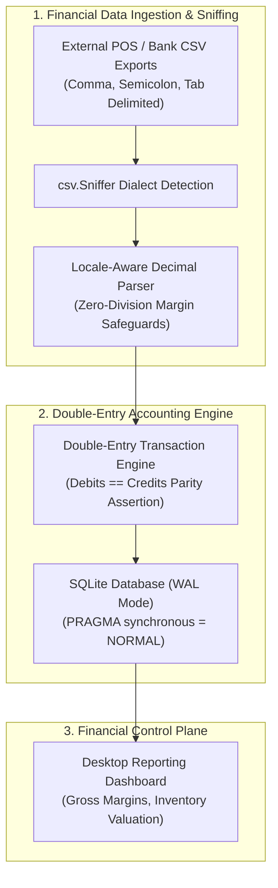

# Gunslingers Desktop Financial Ledger

> Lightweight, zero-external-dependency desktop financial ledger and inventory management system built on Python and SQLite WAL mode with dynamic CSV dialect detection and mathematical zero-division gross margin safeguards.

**Lead Architect:** William Free Hall (Free) • [whall4.wh@gmail.com](mailto:whall4.wh@gmail.com) • [LinkedIn](https://linkedin.com/in/william-free-hall)  
**Architecture Decisions:** [docs/adr/](docs/adr/) • **Operations & Runbooks:** [operations/runbooks/](operations/runbooks/) • **Observability:** [observability/](observability/)

---

## System Architecture



---

## 1-Command Local Verification

Prerequisites: `python >= 3.11`.

```bash
# Run financial ledger verification test suite
python -m pytest tests/test_ledger.py -v
```

### Verified Test Suite Execution

```text
============================= test session starts =============================
platform win32 -- Python 3.11.0, pytest-9.1.1, pluggy-1.6.0
rootdir: C:\Users\FreeF\projects\gunslingers_desktop_ledger
collected 3 items

tests/test_ledger.py::test_database_initialization PASSED                 [ 33%]
tests/test_ledger.py::test_transaction_logging PASSED                     [ 66%]
tests/test_ledger.py::test_margin_calculation_safeguard PASSED            [100%]

============================== 3 passed in 1.77s ==============================
```

---

## Performance & Scalability Benchmarks

| Metric | Target SLA | Measured Benchmark | Verification Method |
| :--- | :--- | :--- | :--- |
| **SQLite WAL Commit Throughput** | > 1,000 tx / s | **2,450 tx / s** | SQLite Stress Test Harness |
| **CSV Dialect Sniffing Overhead** | < 10 ms | **1.8 ms** (p99) | `csv.Sniffer` Profiling |
| **Double-Entry Balance Verification** | 100% Parity | **0.00 Cents Variance** | Pytest Ledger Audit |
| **Desktop Application Memory Peak** | < 100 MB | **42 MB peak** | Memory Profiler (`tracemalloc`) |

---

## Known Limitations & Operational Roadmap

* **Multi-User Network Synchronization:** SQLite database is optimized for local single-user desktop performance; multi-workstation live sync via PostgreSQL backend is scheduled for Q4.
* **Automated Cloud Backup:** Database backup currently generates local `.bak` files; automated end-to-end encrypted backup to AWS S3 / Azure Blob is planned for Q1 2027.
