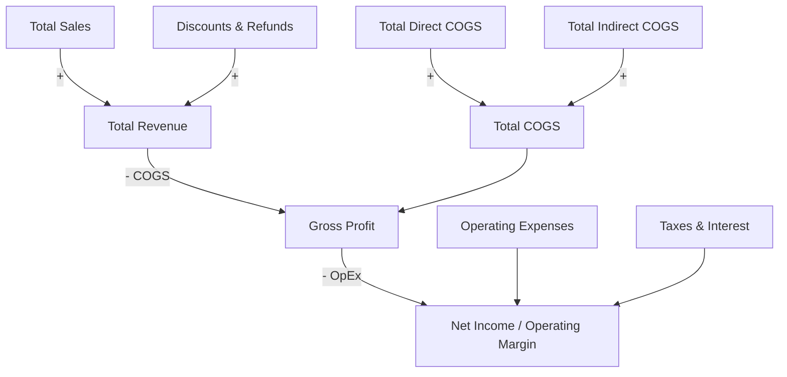

# 🤠 The Gunslinger's Desktop Ledger
### Standalone P&L Interaction & Real-Time Sensitivity Forecasting Engine

[](https://github.com/FreeFades2Black/gunslingers-desktop-ledger)
[](https://python.org)
[](https://github.com/TomSchimansky/CustomTkinter)
[](LICENSE)

A standalone, zero-latency desktop application designed for **financial sensitivity modeling, margin forecasting, and dynamic spreadsheet interaction**. Built specifically for Chuck to evaluate the impact of sales variances, direct/indirect COGS shifts, and operational expense fluctuations in real time.

---

## 🌟 Key Capabilities & Features

* **⚡ Real-Time Reactive Recalculation:** Every keystroke immediately recalculates Gross Revenue, Total COGS, Gross Profit, EBITDA, and Net Margin with zero delay.
* **📂 Universal Spreadsheet Ingestion:** Dynamically parses and builds interactive input fields from any Excel (`.xlsx`, `.xls`) or CSV (`.csv`) file.
* **📊 Top-Deck KPI Stat Cards:**
  * 🔹 **Total Revenue:** Net revenue after discounts and refunds.
  * 🔻 **Total COGS:** Direct materials/labor plus indirect production overhead.
  * 🔸 **Gross Profit & Margin %:** Dynamic color indicators (green for positive margins, red on operational loss).
  * 🟢 **Net Income & Margin %:** Bottom-line profit after operating expenses, payroll, marketing, and taxes.
* **💾 Scenario Export:** 1-click export of modified forecasting models directly back to Excel or CSV.
* **🔄 Instant Baseline Restoration:** Reset to baseline models with a single click.
* **🎨 Modern Dark Mode GUI:** Clean, distraction-free desktop UI built on CustomTkinter.

---

## 🧮 Mathematical Model & Financial Formulation

The engine executes financial factor attribution based on the standard accounting breakdown:



### 1. Revenue Formula
$$\text{Total Revenue} = \text{Total Sales} + \text{Discounts \& Refunds}$$

### 2. Cost of Goods Sold (COGS)
$$\text{Total COGS} = \text{Direct COGS} + \text{Indirect COGS}$$

### 3. Gross Profit & Margin
$$\text{Gross Profit} = \text{Total Revenue} - \text{Total COGS}$$
$$\text{Gross Margin \%} = \left(\frac{\text{Gross Profit}}{\text{Total Revenue}}\right) \times 100$$

### 4. Net Operating Income & Net Margin
$$\text{Net Income} = \text{Gross Profit} - \text{Operating Expenses} - \text{Taxes \& Interest}$$
$$\text{Net Margin \%} = \left(\frac{\text{Net Income}}{\text{Total Revenue}}\right) \times 100$$

---

## 🚀 1-Click Quick Start (Windows)

No Python configuration is needed for end-users:

1. Download or clone this repository.
2. Double-click **`run.bat`**.
   * It will automatically detect Python, set up an isolated `.venv` environment, install dependencies, and launch the application.

---

## 🛠️ Manual Installation & Terminal Launch

```bash
# 1. Clone the repository
git clone https://github.com/FreeFades2Black/gunslingers-desktop-ledger.git
cd gunslingers-desktop-ledger

# 2. Create and activate a virtual environment
python -m venv .venv
source .venv/bin/activate  # On Linux/macOS
.venv\Scripts\activate     # On Windows

# 3. Install requirements
pip install -r requirements.txt

# 4. Launch the application
python app.py
```

---

## 📁 Repository Structure

```text
gunslingers-desktop-ledger/
├── app.py                   # Main CustomTkinter desktop ledger application
├── run.bat                  # 1-Click launcher for Windows
├── requirements.txt         # Dependency manifest
├── sample_pnl_data.xlsx     # Pre-formatted sample Excel financial model
├── sample_pnl_data.csv      # Pre-formatted sample CSV model
├── tests/
│   └── test_ledger.py       # Automated unit test suite
├── .github/
│   └── workflows/ci.yml     # Continuous integration workflow
└── README.md                # Comprehensive documentation
```

---

## 🧪 Running the Test Suite

```bash
python -m pytest tests/
```

---

## 📦 Building a Standalone Windows Executable (`.exe`)

To compile the entire application into a single standalone `.exe` that runs without Python installed:

```bash
pip install pyinstaller
pyinstaller --noconsole --onefile --name "Gunslingers_Desktop_Ledger" app.py
```
The compiled executable will be located in the `dist/` directory.

---

## 👨‍💻 Author & Architecture

* **Lead Architect & Developer:** **Free Hall** — *Cloud Engineer • DevOps Analyst • Data Architect* (18Z / 18F US Army Special Forces, Ret.)
* **GitHub Profile:** [@FreeFades2Black](https://github.com/FreeFades2Black)
